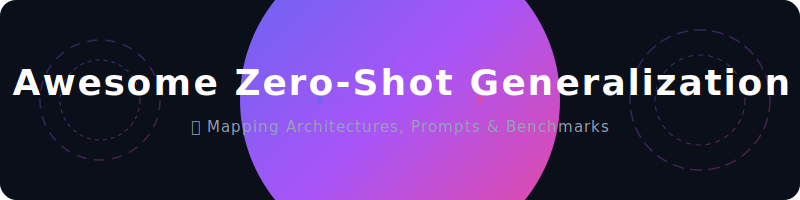

  

# 🚀 Awesome Zero-Shot Generalization

## 🎯 The Zero-Shot Generalization Map

> **A comprehensive reference guide for Zero-Shot Generalization—mapping learning paradigms, structural variants, cross-modal applications, and engineering benchmarks.** 🧠✨

Zero-Shot Generalization is the ability of a machine learning model to successfully execute a task, classify data, or predict an output at inference time without having seen any explicit training examples of that specific task or class. 🔮⚡

---

## 🧭 Core Architectural Paradigms & Types

How models achieve the capacity to generalize to completely novel distributions and intents.

*   **Task-Level Zero-Shot (Instruction Tuning):** 📝 Models generalize to entirely unseen tasks (e.g., translating text, formatting JSON) by aligning language patterns to structural instructions during pre-training.
    *   *Mechanism:* Massively multi-task instruction fine-tuning (e.g., FLAN, InstructGPT). 🛠️
*   **Semantic Semantic-Embedding Mapping (Class-Level):** 🖼️ Aligning visual features into a shared text-image semantic space. The model classifies an unseen image class by matching its visual embedding to the word embedding of the class name.
    *   *Mechanism:* Contrastive Language-Image Pre-training (CLIP). 🔗
*   **Attribute-Based Zero-Shot Learning (Classic ZSL):** 🏷️ Models utilize an intermediate layer of semantic attributes (e.g., "has stripes", "is yellow") to classify a novel object (e.g., a tiger) based purely on a text description of its attributes.
    *   *Mechanism:* Attribute signature matrices mapping seen and unseen classes. 📐
*   **Generative Zero-Shot Generalization:** 🎨 Generative models synthesize high-fidelity data (images, text, audio) for classes or scenarios they have never directly observed, based entirely on textual descriptions.
    *   *Mechanism:* Diffusion models and Autoregressive Transformers. 🌊

---

## 🎛️ Prompts & Evaluation Variations

The runtime strategies used to activate zero-shot capabilities in large foundation models without modifying weights.

*   **Direct Instruction Prompting:** 💬 Providing a clear, declarative command detailing the exact input and expected output format.
    *   *Example:* `"Extract all company names from this text: [Text] -> "` 🔍
*   **Role-Based Zero-Shot Prompting:** 🎭 Assigning a highly specific professional persona to the model to tap into latent semantic distributions within its weights.
    *   *Example:* `"You are a Senior Cloud Infrastructure Architect. Review the following Terraform script for vulnerabilities: "` 🛡️
*   **Zero-Shot Chain-of-Thought (Zero-Shot CoT):** ⛓️ Forcing the model to generate its own sequential reasoning tokens before producing a final answer, triggering latent logical paths.
    *   *Example:* `"Solve the following math puzzle. Let's think step by step: "` 🧠
*   **Format-Constrained Zero-Shot:** 🧱 Using structured schema definitions (like Pydantic or JSON Schema) to force zero-shot output to match strict downstream software dependencies.

---

## 🚀 Real-World Applications by Domain

Where zero-shot systems are replacing traditional fine-tuned classifiers in production pipelines.

### 🖼️ Computer Vision & Moderation
*   **Application:** Open-vocabulary object detection, zero-shot video classification, and automated content moderation. 🛡️
*   **Variant:** **Shared Latent Spaces** (CLIP-driven pipelines). 🌐
*   **Use Case:** Setting up a content filter for an e-commerce platform that instantly flags novel, prohibited items (e.g., "vape pens in neon packaging") without needing to collect thousands of training images. 🛒

### 🎙️ Audio Processing & Voice Synthesis
*   **Application:** Zero-shot text-to-speech (TTS) cloning and universal acoustic translation. 🗣️
*   **Variant:** **Generative Audio Transformers** (e.g., VALL-E, Voicebox architecture). 🎵
*   **Use Case:** Localizing video content by cloning a speaker’s voice into a completely foreign language they do not speak, using only a 3-second audio snippet, without speaker-specific fine-tuning. 🌍

### 🩺 Healthcare & Biomedical Analytics
*   **Application:** Zero-shot clinical code extraction and novel protein-protein interaction prediction. 🧬
*   **Variant:** **Domain-Specific Foundation Models** (e.g., BioGPT, ESM). 🧪
*   **Use Case:** Instantly scanning research papers to tag symptoms or genetic markers for a newly discovered disease mutation that did not exist when the model's core vocabulary was originally built. 🧫

### 💻 Enterprise Data Engineering & ETL
*   **Application:** Zero-shot schema matching, cold-start user profiling, and unstructured log parsing. 📊
*   **Variant:** **Instruction-Tuned LLMs**. ⚙️
*   **Use Case:** Ingesting arbitrarily formatted invoices from thousands of disparate suppliers and mapping them perfectly to a unified internal SQL schema without writing manual regular expressions or parsing loops for each vendor. 📁

---

## 🔬 Industry Standard Benchmarks

How researchers measure the robust boundary limits of zero-shot models.

| Benchmark Name | Modality | What It Tests |
| :--- | :--- | :--- |
| **MMLU** (Massive Multitask Language Understanding) | 📝 Text | Cross-disciplinary zero-shot knowledge acquisition across 57 subjects. |
| **ImageNet-A / R** | 🖼️ Vision | Zero-shot visual robustness against natural adversarials and artistic renditions. |
| **SWE-bench** | 💻 Code | Resolving real-world software engineering GitHub issues completely end-to-end. |
| **BIG-bench** | 🎛️ Multi-modal | Extreme out-of-distribution reasoning and pattern completion tasks. |

